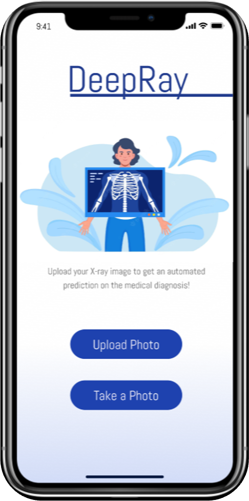
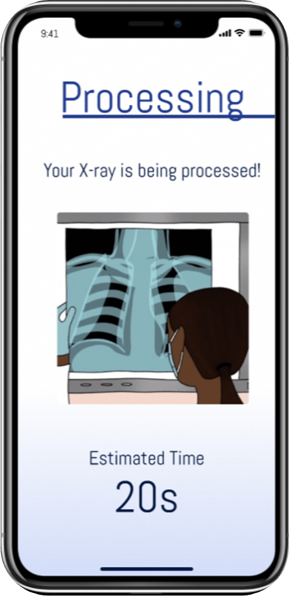
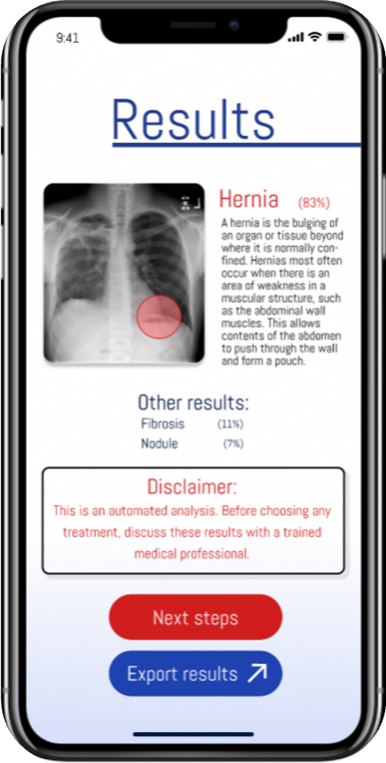
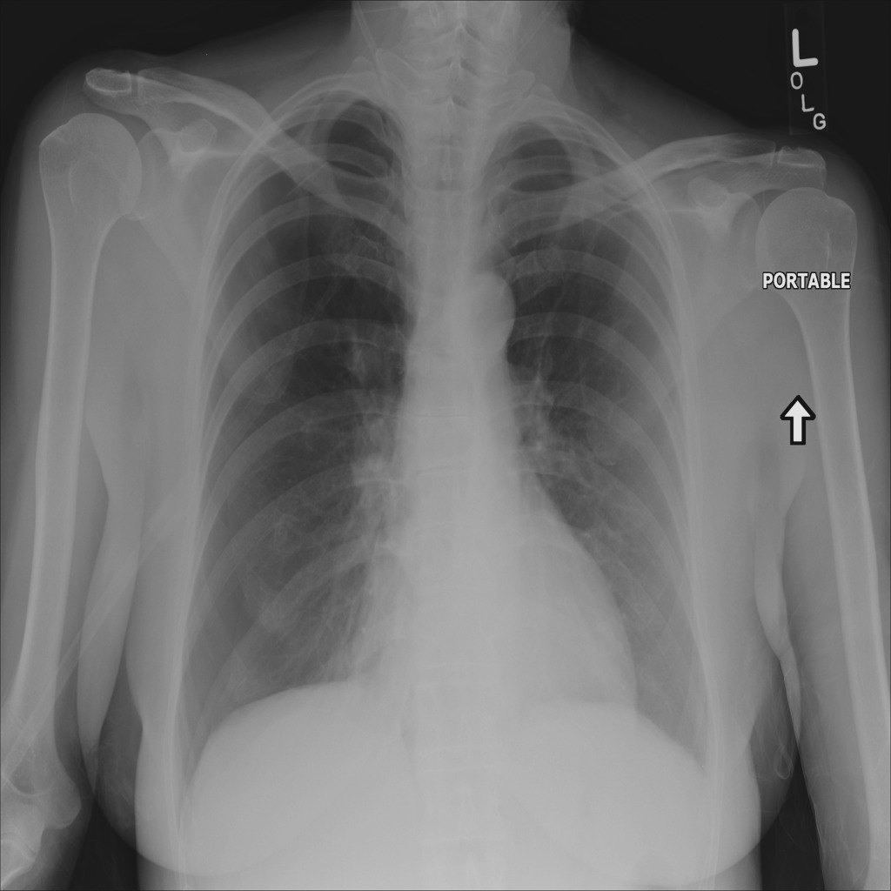
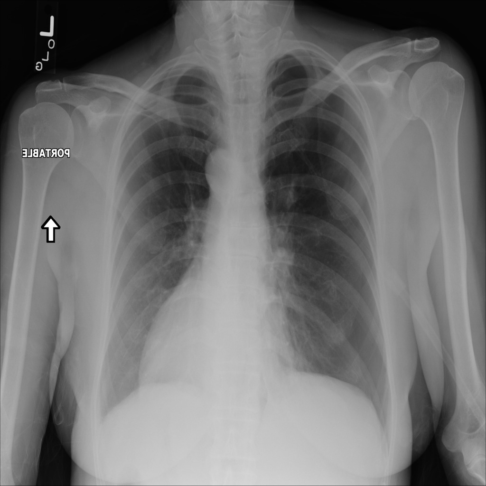
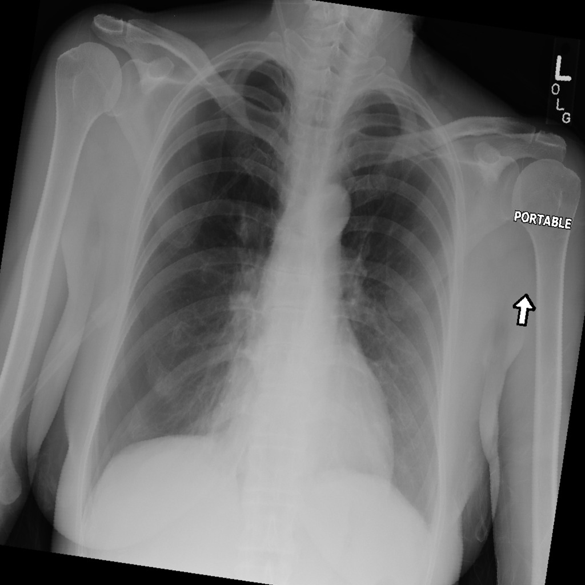
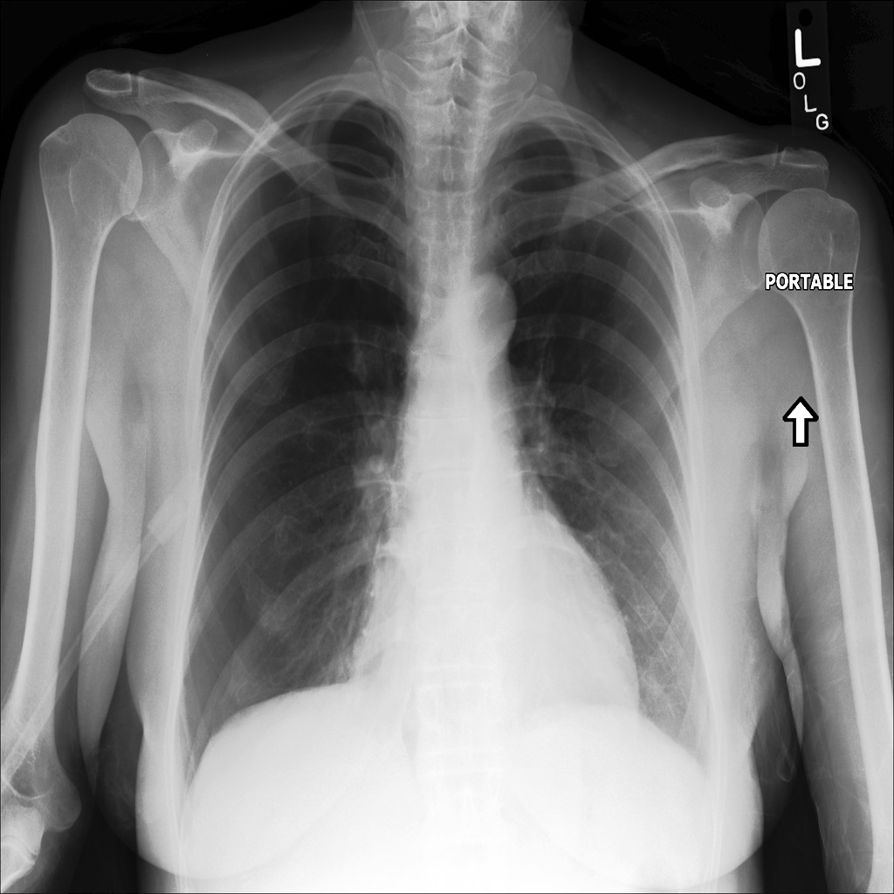
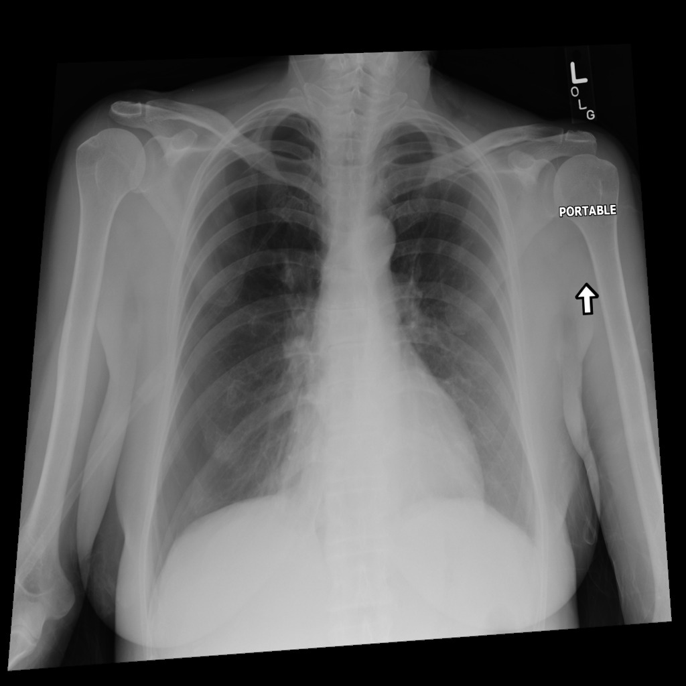
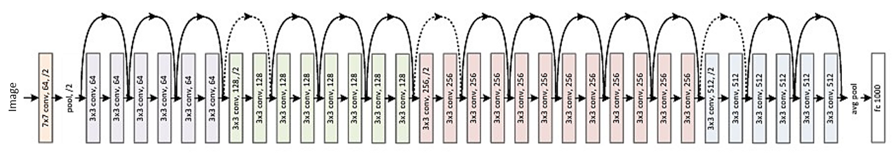

# DeepRay by DS@LMU for MI4People x TUM.ai Makeathon 2022

    
    
    
    

**Topic:** Healthcare Computer Vision for Developing World  
**Topic Owner**: MI4People - Paul Springer   
**Team:** Nikolas Gritsch, Selen Erkan, Faheem Zunjani, Seunghee Jeong, I. Tolga Ozturk  

## About

Worldwide shortfall of 18 million health workers by 2030, the situation in developing countries is
especially severe.

Every year ca. 6 million people die in developing countries from low quality healthcare. One of the
reason for it is a lack of specialized medical staff who can identify right diagnosis. In some
countries 65% of diagnoses are wrong1).

Machine Learning was proven to be able to make accurate diagnoses, especially if the
diseases/injuries are identified on images (X-rays, CT and MRI scans, photos).

An AI-driven assistant could help primary-care physicians in developing
countries to determine right diagnoses with higher accuracy and save
many lives!

Further information can be found in our [pitch deck](https://docs.google.com/presentation/d/1psSJE-DRKFVCCiP6ZskA2gDGFjbm6F1db3KyFMXO0kE/edit?usp=sharing).

## Description of the Solution

### Data Engineering

As can be seen below, the provided dataset suffers terribly from imbalance between the classes. 

To tackle this, we implement several strategies described in the next subsections.

#### Balanced Data Sampling

- Over-sampled rare classes from the full dataset
- Under-sampled overrepresented classes

#### Smart Data Augmentation

The provided standard dataset in our opinion is not very representative of the data that our model
will face in the real world, especially in the developing countries.   
In order to tackle this, we apply several data augmentation strategies, especially to balance out the rare classes 
as shown below:

| Original                                                          | Horizontal Flip                                                     | Affine Rotation                                                    | Color Jitter |                                                          
|-------------------------------------------------------------------|---------------------------------------------------------------------|--------------------------------------------------------------------|-------------------------------------------------------------------|
|  |  |  |  |

| Contrasting                                                       | Random Perspective                                                          | Gaussian Blur                                                          | 
|-------------------------------------------------------------------|-----------------------------------------------------------------------------|------------------------------------------------------------------------|
|  |  |  |

We probabilistically applied a few/all of these augmentations to generate even more images.

#### Model Development

To quickly determine which model family would be better to explore deeply, 
we used an Automated-Machine Learning library AWS AutoGluon for Multi-Class Classification on the provided dataset.
Among ResNet50, EfficientNet and MobileNet, ResNet50 performed the best (64% accuracy) so we decided to use it for 
further development.   

Next, we coded up our own Dataloaders for the engineered and augmented datasets, training loops and used ResNet50 
without pre-training so that it adapts to our use-case.

Due to computational budget restrictions, we could not finish training our model however, our model consistently learned 
with increasing accuracy, precision and recall after each epoch.

ResNet-34 for reference (ResNet-50 just has further repetitions to deepen the network): 

#### Model Distillation

In order to reduce the model complexity and weight for offline deployment on the app
we will implement the recommendations of [An Embarrassingly Simple Approach for Knowledge Distillation](https://arxiv.org/pdf/1812.01819.pdf)
to perform Knowledge Distillation where our trained ResNet50 model
teaches a much smaller and lightweight ResNet18 model which will be deployed with the 
mobile app. The paper demonstrates that with a negligible drop in accuracy
we can teach our smaller model to imitate the predictions of our bigger model.    

ResNet-18 for reference:  
   

The distilled model will be deployed with the mobile app. 

#### Mobile App

We've built a proof-of-concept mobile app with React Native that demonstrates the interface
that will be used by our users. The code can be found in the mobile-app branch of this repository. 

## Instructions 

Please structure the data in the following manner:
1. "data" folder present in the project root
2. "image_samples" folder within data contains all the images
3. A CSV Dataset must be preset in the "data" folder which contains the list of image paths and labels

For Data Sampling: Run the sample_rare_classes.ipynb notebook.  
For Data Augmentation: Run the Data Augmentation.ipynb notebook.   
For Training the big model: Run src/main.py  
For running the Mobile-App: Switch branch to mobile-app and run the code in the deepray folder on XCode simulator.   

## Acknowledgement

We thank Paul Springer from MI4People for giving a detailed deep dive into the project and his feedback 
during the development of the product. 

